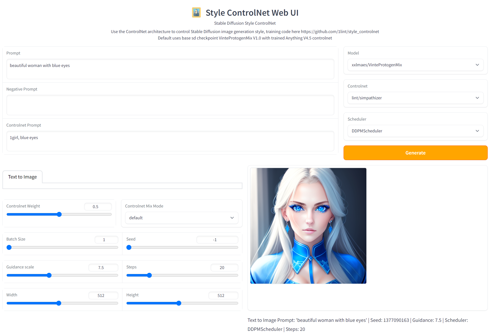

# ControlStyle  
Proof of concept for controlling Stable Diffusion image style using a ControlNet.

<p align="center"></p>


`prompt`: "beautiful woman with blue eyes", `controlnet_prompt`: "1girl, blue eyes"


`prompt` and `controlnet_prompt`: "1girl, red eyes, masterpiece, best quality, ultra-detailed, illustration, mksks style, best quality, CG, HDR, high quality, high-definition, extremely detailed, earring, gown, looking at viewer, detailed eyes"

`controlnet_conditioning_scale` increments by 0.1 from 0 to 1, left to right. 

## ControlNet for Style 

Lvmin introduced the [Controlnet](https://github.com/lllyasviel/ControlNet) to use a cloned Stable Diffusion UNet to introduce external conditioning, such as body poses/sketch lines, to guide Stable Diffusion generation with fantastic results.

I thought his approach might also work for introducing different styles (i.e. add anime style), in guiding the image generation process. Instead of cloning the original UNet, I cloned a separate anime styled UNet to act as the ControlNet Model. Then I trained the model's zero convolution weights on a (synthetic) anime image dataset [Anybooru](https://github.com/1lint/anybooru) (generated with anything-v4.5). 

For my initial training run, both the UNet weights for the original model (`runwayml/stable-diffusion-v1-5`) and the controlnet (`andite/anything-v4.0`) were frozen and only the zero convolution weights of the controlnet model was trained. 
For subsequent runs, only the UNet weights for the original model (`xxlmaes/VinteProtogenMix`) were frozen, and the entire controlnet (`andite/anything-v4.5`) was trained. 

I think the preliminary results look promising, and opens up the potential for dynamically mixing styles (like a painter's palette) from many different Stable Diffusion checkpoints as a user controlled setting.


## Quick Start

For a basic inference example, see https://huggingface.co/lint/simpathizer. This was the model used to generate the examples

For a basic training example with HF Accelerate, run the following
```
pip install -r requirements.txt
python quickstart_train.py
```
By default, the script will download pipeline weights and an image dataset from HF Hub.
The base stable diffusion checkpoint and controlnet weights can either be in HF diffusers format or the original stable diffusion pytorch-lightning format (inferred based on whether destination is file or not)

## Web UI

Launch the Web UI with 
```
pip install -r controlstyle_ui/requirements.txt
python controlstyle_ui/app.py
```

Try the WebUI at https://huggingface.co/spaces/lint/controlstyle_ui




